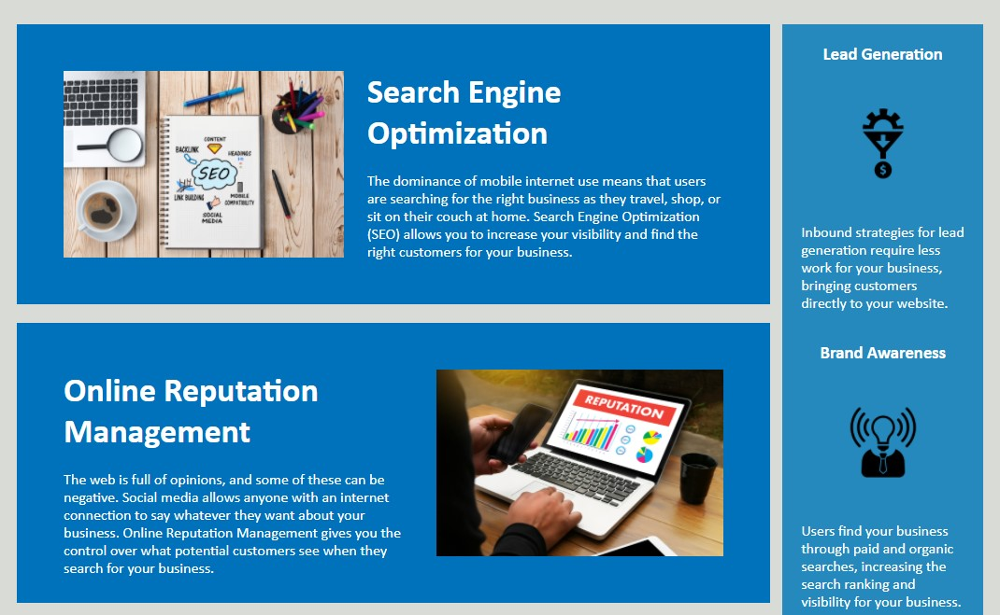
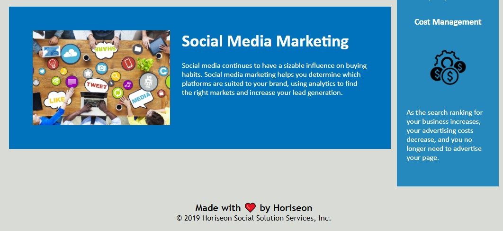

# Homework - 01 HTML, CSS, and Git: Code Refactor
### Overview:
This is the first homework that is required for the University of Denver Coding Boot Camp.  The assignment was to refactor existing code for the Horiseon Social Solutions Services website.  The refactoring will alter the code so that it follows website accessibility standards and will allow for search engine optimization. 


#### Code: 
The website is built with HTML and CSS. 

- Refactoring included changing HTML tags using semantic elements.  
&nbsp;&nbsp;&nbsp;&nbsp;&nbsp; *HTML Example:* 
&nbsp;&nbsp;&nbsp;&nbsp;&nbsp;```<div class="content>```
&nbsp;&nbsp;&nbsp;&nbsp;&nbsp; was changed to 
&nbsp;&nbsp;&nbsp;&nbsp;&nbsp;```<main class="content">```

- A descriptive title was added to the site along with alt attributes for all the images.  

- The CSS was reorganized and comments were added to provide clarity.


#### Links:

- [Link to Horiseon Website](https://markraud.github.io/hw-01-html-css-git-code-refactor/).

- [Link to GitHub Repository](https://github.com/markraud/hw-01-html-css-git-code-refactor).


#### Screenshots of the site:






#### Contact Info:
Built by Mark Raudenbush
markraud@hotmail.com
- [My LinkedIn](https://www.linkedin.com/in/markraudenbush)
- [My GitHub](https://github.com/markraud?tab=stars)

#### License:
The MIT License (MIT)

#### Summary:

This project taught me about using semantic HTML and also helped me understand how to consolidate CSS code so that it does not repeat. 

Other important things covered were:
- creating a GitHub repository
- deploying a site using GitHub
- creating valuable readme files using markdown

